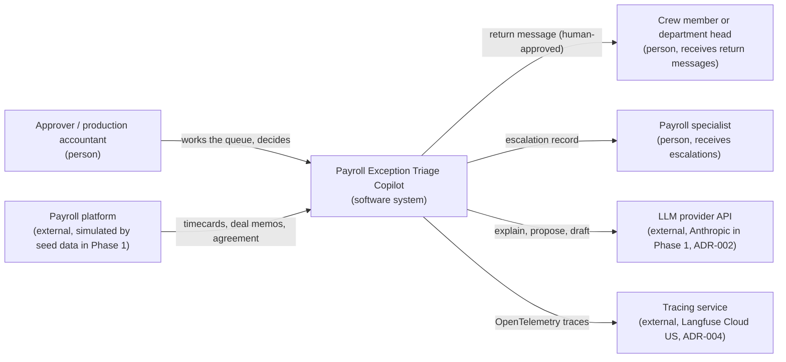

# Architecture overview

Phase 1 target architecture. Diagrams are Mermaid. Decisions referenced as ADR-NNN live in `docs/decisions/`.

## 1. C4 level 1: system context



## 2. C4 level 2: containers

```mermaid
flowchart TB
    subgraph browser["Approver's browser"]
        ui["Queue UI<br/>React + TypeScript + Vite (ADR-013)"]
    end

    subgraph compose["Docker compose (one command, ADR: deployment in It6)"]
        api["API<br/>Python 3.12 + FastAPI<br/>REST: queue, case detail, decide, evals"]
        graph["Triage graph<br/>LangGraph state machine per case<br/>checkpointer on PostgreSQL (ADR-013)"]
        engine["Rule engine + action policy<br/>pure Python, parameters from YAML (ADR-007, ADR-008, ADR-009)"]
        adapter["LLM adapter v1<br/>provider-agnostic interface, Anthropic implementation (ADR-002)"]
        validator["Citation validator<br/>code"]
        db[("PostgreSQL 16 + pgvector<br/>timecards, deal memos, corpus chunks, cases, audit log, checkpoints")]
        seed["Seed + data generator<br/>18 scenarios, seeded RNG"]
        evals["Eval harness + two-tier gate (ADR-003)"]
    end

    llm["LLM provider API"]
    tracing["Langfuse Cloud (US)"]

    ui -->|"HTTPS JSON"| api
    api --> graph
    api --> engine
    graph --> engine
    graph --> adapter
    graph --> validator
    adapter --> llm
    graph --> db
    api --> db
    engine --> db
    seed --> db
    evals --> graph
    evals --> adapter
    api -.->|"OTel"| tracing
    graph -.->|"OTel"| tracing
    adapter -.->|"OTel"| tracing
```

Container responsibilities:

| Container | Deterministic or LLM | Writes to the database |
| --- | --- | --- |
| API | deterministic | cases, decisions (as the human actor) |
| Triage graph | orchestrates both | checkpoints, suggestions (LLM outputs stored as suggestions), audit entries |
| Rule engine and action policy | deterministic | findings and facts |
| LLM adapter | LLM | nothing |
| Citation validator | deterministic | validation results |
| Eval harness | both (runs the graph and an LLM judge) | eval runs |

## 3. LangGraph state machine (one run per exception case)

```mermaid
stateDiagram-v2
    [*] --> detect
    detect: detect (code)<br/>rule engine findings + facts + policy action
    retrieve: retrieve (code)<br/>hybrid search over agreement + deal memo chunks
    explain: explain (LLM)
    propose: propose (LLM)
    draft: draft (LLM)
    validate: validate citations (code)
    review: needs human review (code)<br/>facts only, no generated text shown as valid
    checkpoint: HUMAN CHECKPOINT<br/>interrupt; resume with decision
    execute: execute (code, human identity)<br/>approve / return / escalate
    audit: audit (code, append-only)

    detect --> retrieve: findings exist
    detect --> [*]: no findings (clean week)
    retrieve --> explain
    explain --> propose
    propose --> draft
    draft --> validate
    validate --> checkpoint: all citations valid and proposal matches policy
    validate --> review: citation invalid or proposal mismatch
    explain --> review: LLM error or timeout
    propose --> review: LLM error or timeout
    draft --> review: LLM error or timeout
    review --> checkpoint
    checkpoint --> execute: human decision (approve / return / escalate), edited message
    execute --> audit
    audit --> [*]
```



Node contracts:

| Node | Owner | Input | Output | Failure behavior |
| --- | --- | --- | --- | --- |
| detect | code | timecard, deal memo, parameters | findings (rule id, section, facts), policy action, priority score | exception stops the run; case not created |
| retrieve | code | findings, deal memo id, week ending | ranked chunks with citation keys, version, offsets | empty retrieval routes to needs human review |
| explain | LLM | findings with facts, chunks | explanation text with citation keys | error or timeout routes to needs human review |
| propose | LLM | findings, policy action, chunks | proposed action, justification, requested correction | same |
| draft | LLM | findings, proposal, recipient role | return message draft | same |
| validate citations | code | explanation, proposal, corpus | pass or fail per citation; proposal versus policy comparison | fail routes to needs human review |
| needs human review | code | facts, failure reason | case flagged; approver sees engine facts and the reason | n/a |
| human checkpoint | human | case, suggestions or review flag | decision, edited message, actor | run stays interrupted until resumed |
| execute | code | decision | status change, premium lines, message sent or escalation record | error recorded; no partial write |
| audit | code | everything above | append-only entries with timestamp and actor | mandatory; failure fails the run |

Rule (constraint 7, ADR-009): there is no path from detect to the checkpoint that produces explanation, proposal or draft text without the LLM. The needs-human-review path shows facts and a reason, nothing templated as if it were an explanation.

## 4. Deterministic versus LLM responsibilities

| Responsibility | Deterministic code | LLM |
| --- | --- | --- |
| Detect findings | yes | no |
| Compute hours, minutes, increments, amounts (ADR-008) | yes | never |
| Decide the policy action (ADR-009) | yes | proposes and justifies; must match |
| Prioritize the queue | yes | no |
| Retrieve passages | yes (hybrid search) | no |
| Explain the finding with citations | no | yes |
| Draft the return message | no | yes |
| Validate citations against corpus and version | yes | no |
| Execute approve, return, escalate | yes, after the human checkpoint, under the human's identity | never |
| Write the audit log | yes | never |
| Judge quality in evals (ADR-003, tier 2) | no | yes, with a rubric |
| Check deterministic eval expectations (tier 1) | yes | no |

## 5. Data model (Phase 1, outline)

- `agreement_versions` (code, version, effective_from, effective_to) and `corpus_chunks` (version, section, heading, text, embedding, permission_scope reserved for Phase 2, ADR-011).
- `deal_memos`, `employees`, `productions`, `timecards`, `timecard_days`.
- `cases` (timecard, findings, policy action, priority, status), `suggestions` (LLM outputs with validation result), `decisions` (human actor, action, message), `audit_log` (append-only).
- LangGraph checkpoint tables created by the PostgreSQL checkpointer in the same database (ADR-013).

## 6. Cross-cutting

- Configuration: provider, model name, tracing keys and region, database URL from environment; the rule parameters from `data/rule-parameters.yaml`.
- Observability: OpenTelemetry spans per node and per LLM call, exported to Langfuse Cloud (US region) in Phase 1 (ADR-004).
- Security perimeter: the LLM adapter has no database handle; API actions require the user identity; secrets never in the repository.
- Testing: unit tests for the engine and policy against YAML parameters; integration tests for the graph with a fake adapter; evals with the real adapter behind the gate.
