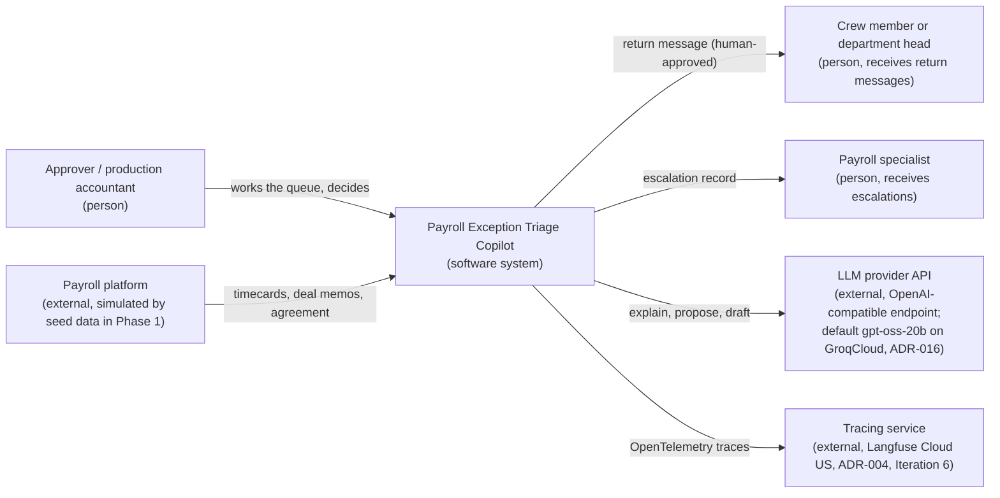
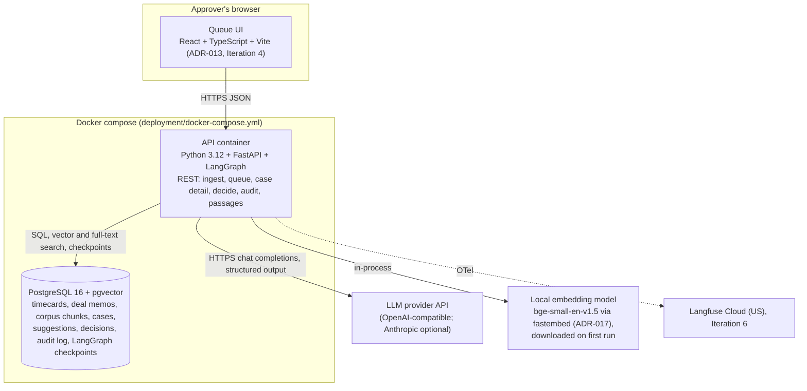
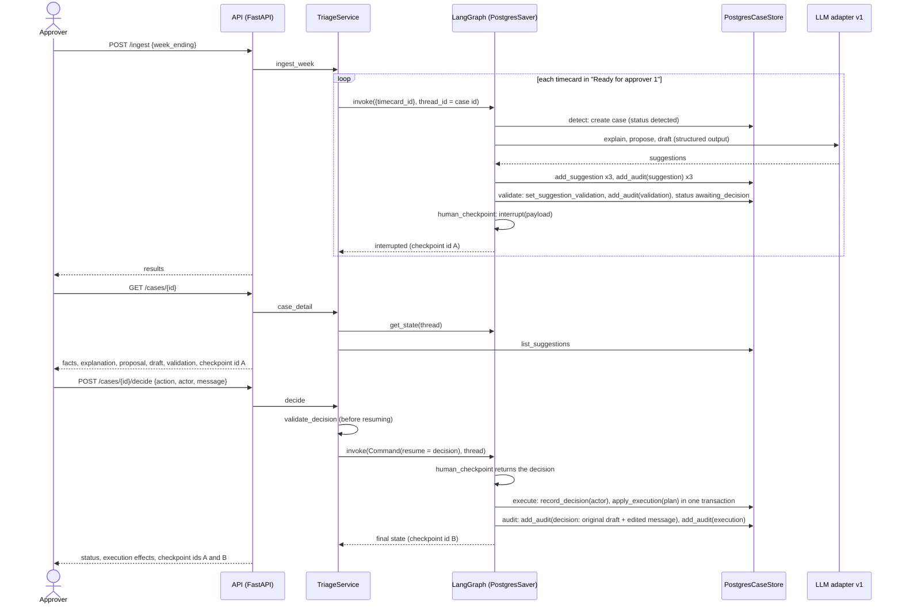

# Architecture overview

Phase 1 target architecture, updated for Iteration 2 (the vertical slice exists in code). Diagrams are Mermaid. Decisions referenced as ADR-NNN live in `docs/decisions/`.

## 1. C4 level 1: system context

## 2. C4 level 2: containers

Container responsibilities:

| Container | Deterministic or LLM | Writes to the database |
| --- | --- | --- |
| API (FastAPI, hosts the graph) | orchestrates both | through the case store only: cases, suggestions, decisions, effects, audit entries, checkpoints |
| PostgreSQL | n/a | n/a |
| LLM provider | LLM | nothing (no database handle) |
| Local embedding model | deterministic | nothing (vectors are written by the ingestion code) |

## 3. C4 level 3: backend components (`backend/src/payroll_triage/`)

```mermaid
flowchart TB
    subgraph api_c["api/app.py (FastAPI)"]
        endpoints["Endpoints: POST /ingest, GET /queue, GET /cases/{id},<br/>POST /cases/{id}/decide, GET /cases/{id}/audit, GET /passages/{key}"]
    end
    runtime["runtime.py<br/>wires settings, pools, checkpointer, adapter, retriever, graph"]
    service["graph/service.py: TriageService<br/>run_timecard, ingest_week, decide, case_detail"]
    subgraph graph_c["graph/ (LangGraph state machine)"]
        build["build.py: nodes and edges"]
        nodes["nodes.py: detect, retrieve, explain, propose, draft,<br/>validate, needs_human_review, human_checkpoint, execute, audit"]
        prompts["prompts.py: system prompt, per-node prompts,<br/>strict JSON schemas (ExplainOutput, ProposeOutput, DraftOutput)"]
        execplan["execute.py: validate_decision, plan_execution"]
    end
    subgraph engine_c["engine/ (deterministic)"]
        rules["rules.py: MEAL_PERIOD rule, detect()"]
        facts["facts.py: MealPeriodFacts schema"]
        priority["priority.py: queue priority score"]
    end
    calc["calc.py: time and money arithmetic"]
    policy["policy.py: ADR-009 policy table, combined_action"]
    params["params.py: rule parameters from data/rule-parameters.yaml"]
    timecards["timecards.py: Timecard, TimecardDay"]
    subgraph retrieval_c["retrieval/"]
        chunker["chunker.py: agreement and deal memo chunks"]
        embeddings["embeddings.py: FastEmbedEmbedder (ADR-017)"]
        search["search.py: PostgresRetriever,<br/>hybrid search with reciprocal rank fusion"]
        citations["citations.py: validate_citations"]
        index["index.py: ingest_corpus"]
    end
    subgraph llm_c["llm/v1/ (ADR-002, ADR-016)"]
        iface["interface.py: LLMRequest, LLMResponse, LLMError, LLMAdapter"]
        oai["openai_compatible.py: Groq, OpenAI, Ollama, others"]
        anth["anthropic_adapter.py (optional)"]
        pacing["pacing.py: Pacer, call_with_retries"]
        factory["factory.py: build_adapter(settings)"]
    end
    subgraph db_c["db/"]
        store["store.py: PostgresCaseStore (only write path to application tables)"]
        migrate["migrate.py + migrations/0001_initial.sql"]
        seed["seed.py"]
        conn["connection.py: app pool, checkpointer pool"]
    end
    config["config.py: Settings from the root .env"]
    saver["langgraph.checkpoint.postgres.PostgresSaver (ADR-013)"]
    pg[("PostgreSQL 16 + pgvector")]
    provider["LLM provider API"]

    endpoints --> service
    runtime --> service
    runtime --> factory
    runtime --> config
    service --> build
    build --> nodes
    nodes --> prompts
    nodes --> execplan
    nodes --> rules
    nodes --> search
    nodes --> citations
    nodes --> store
    nodes --> iface
    rules --> facts
    rules --> priority
    rules --> calc
    rules --> policy
    rules --> params
    rules --> timecards
    search --> embeddings
    index --> chunker
    index --> embeddings
    factory --> oai
    factory --> anth
    oai --> pacing
    oai --> provider
    store --> pg
    search --> pg
    migrate --> pg
    seed --> pg
    build --> saver
    saver --> pg
```

Component rules: `llm/v1` is the only package that talks to a provider and it has no database handle; `db/store.py` is the only module that writes application tables; `engine/` and `policy.py` are pure; `graph/nodes.py` is the only place where the three are combined.

## 4. LangGraph state machine (one run per exception case)

Node names below are the node names in `graph/build.py`.

```mermaid
stateDiagram-v2
    [*] --> detect
    detect: detect (code)<br/>engine findings + facts + policy action + priority; case row created
    retrieve: retrieve (code)<br/>hybrid search per finding + the rule's sections + the case's deal memo chunk
    explain: explain (LLM)
    propose: propose (LLM)
    draft: draft (LLM)
    validate: validate (code)<br/>citation keys exist for the version in force, deal memo is the case's,<br/>no number outside facts and passages, proposal equals policy
    needs_human_review: needs_human_review (code)<br/>facts only; reason recorded; nothing templated
    human_checkpoint: human_checkpoint<br/>interrupt(); resume with the decision
    execute: execute (code, human identity)<br/>approve / return / escalate in one transaction
    audit: audit (code, append-only)

    detect --> retrieve: findings exist
    detect --> [*]: no findings (clean week), no case
    retrieve --> explain
    retrieve --> needs_human_review: no passages
    explain --> propose
    propose --> draft
    draft --> validate
    validate --> human_checkpoint: valid
    validate --> needs_human_review: invalid
    explain --> needs_human_review: LLM error, timeout or unparsable output
    propose --> needs_human_review: LLM error, timeout or unparsable output
    draft --> needs_human_review: LLM error, timeout or unparsable output
    needs_human_review --> human_checkpoint
    human_checkpoint --> execute: decision (approve / return / escalate), actor, message
    execute --> audit
    audit --> [*]
```

Node contracts:

| Node | Owner | Input | Output | Failure behavior |
| --- | --- | --- | --- | --- |
| detect | code | timecard, deal memo, parameters, clock | findings (rule id, section, facts, policy row), policy action, amount, priority score | exception stops the run; case not created |
| retrieve | code | findings, deal memo id | chunks with citation keys and version (ranked plus the rule's sections and the deal memo) | empty retrieval routes to needs_human_review |
| explain | LLM | case context, findings with facts and their meaning, chunks | explanation with citation keys (stored as a suggestion) | error, timeout or schema mismatch routes to needs_human_review |
| propose | LLM | the same plus the policy table and the policy action | proposed action, justification, requested correction | same |
| draft | LLM | the same plus the proposal | recipient role, subject, body | same |
| validate | code | the three outputs, corpus, version in force, facts | per-output validation detail; suggestions marked valid or invalid | any problem routes to needs_human_review |
| needs_human_review | code | reason | case status `needs_human_review`, review audit entry | n/a |
| human_checkpoint | human | case, suggestions or review reason | decision (action, actor, message) | run stays interrupted until resumed |
| execute | code | decision, findings | timecard status, premium lines, return message or escalation; case status | transaction rolls back; nothing partial |
| audit | code | decision, original draft, execution effects | decision and execution entries with actor and timestamp | failure fails the run |

Rule (constraint 7, ADR-009): there is no path from detect to the checkpoint that produces explanation, proposal or draft text without the LLM. The needs_human_review path shows facts and a reason, nothing templated as if it were an explanation.

## 5. Sequence: the human checkpoint

The LLM never appears after the checkpoint: the resume path contains only code and the human's decision.

## 6. Deterministic versus LLM responsibilities

| Responsibility | Deterministic code | LLM |
| --- | --- | --- |
| Detect findings | yes | no |
| Compute hours, minutes, increments, amounts (ADR-008) | yes | never |
| Decide the policy action (ADR-009) | yes | proposes and justifies; must match |
| Prioritize the queue | yes | no |
| Retrieve passages | yes (hybrid search) | no |
| Explain the finding with citations | no | yes |
| Draft the return message | no | yes |
| Validate citations against corpus and version; detect stray numbers | yes | no |
| Execute approve, return, escalate | yes, after the human checkpoint, under the human's identity | never |
| Write the audit log | yes | never |
| Judge quality in evals (ADR-003, tier 2) | no | yes, with a rubric |
| Check deterministic eval expectations (tier 1) | yes | no |

## 7. Data model (Phase 1, migration `0001_initial.sql`)

- `agreement_versions` (code, version, name, effective_from, effective_to).
- `corpus_chunks` (source_type, citation_key unique, agreement_code, version, section, heading, body, effective_from, effective_to, permission_scope reserved for Phase 2 per ADR-011, embedding vector(384), tsv generated full-text column with a GIN index).
- `productions`, `employees`, `deal_memos` (typed columns plus the raw memo as jsonb), `timecards`, `timecard_days`.
- `cases` (timecard, findings jsonb, policy action, amount, priority score, status, review reason, thread id), `suggestions` (LLM outputs with provider, model, adapter version and validation status), `decisions` (human actor, action, message).
- Effects of executed decisions: `premium_lines`, `return_messages`, `escalations`; the `decisions` row and the effects are written in one transaction by the store.
- `audit_log` (entry kind: suggestion, validation, review, decision, execution; actor; payload; timestamp) with triggers that reject UPDATE, DELETE and TRUNCATE. The only exception is the demo reset (`uv run ptc seed --reset`), which disables the truncate trigger inside its own transaction; the API and the graph have no such path.
- LangGraph checkpoint tables (`checkpoints`, `checkpoint_writes`, `checkpoint_blobs`, `checkpoint_migrations`) created by the checkpointer's `setup()` in the same database (ADR-013); thread id equals the case id.

Case statuses: `detected`, `awaiting_decision`, `needs_human_review`, `approved`, `returned`, `escalated`. The queue lists the two open statuses ordered by priority score (descending) then week ending (ascending).

## 8. Hybrid retrieval (ADR-017)

Query text per finding is built by code from the rule title and section plus a few fixed terms for the finding kind. Two searches run over `corpus_chunks`: cosine distance on the pgvector column (`<=>`) and `ts_rank_cd` over the generated tsvector with `to_tsquery('english', ...)` built from the query's words joined by OR, so passages containing more of the words rank higher. Each returns its top k; the lists are fused with reciprocal rank fusion (score = sum over lists of 1 / (60 + rank)); ties break by citation key. The rule's own sections and the case's deal memo chunk are added by key so that the model always sees them. Citation keys: `CGMA-2026.1-<section>` for agreement sections, `DM-NN` for deal memos.

## 9. Cross-cutting

- Configuration: the single root `.env` (template `.env.example`): `PTC_LLM_PROVIDER`, `PTC_LLM_BASE_URL`, `PTC_LLM_MODEL`, provider keys under their standard names, `DATABASE_URL`, embedding model name; the rule parameters from `data/rule-parameters.yaml`. The backend loads the root `.env` when run from `backend/` with uv and receives it as `env_file` in compose.
- Rate limits: client-side pacing (requests per minute from configuration) and retry with exponential backoff honoring `retry-after` on HTTP 429 (ADR-016).
- Observability: OpenTelemetry spans per node and per LLM call, exported to Langfuse Cloud (US region) in Phase 1 (ADR-004), added in Iteration 6; the adapter already records provider, model, adapter version, usage, latency, attempts and rate-limit headers per call.
- Security perimeter: the LLM adapter has no database handle; API actions require the human's identity (`actor`); secrets never in the repository and never printed (`Settings.redacted()`).
- Testing: unit tests for the engine and policy against YAML parameters; the engine is tested against the committed eval manifest; graph tests with a fake adapter and an in-memory store (test modules only); integration tests against the compose database (migrations, seed, audit trigger, hybrid search with the real embedding model, checkpoint survival across a graph rebuild); the real adapter is exercised by `uv run ptc smoke-llm` and `uv run ptc showcase`.
